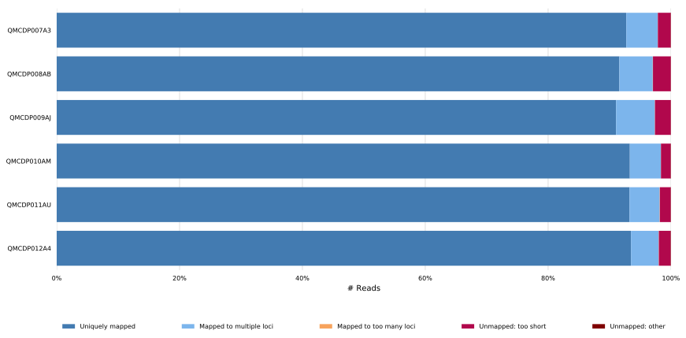
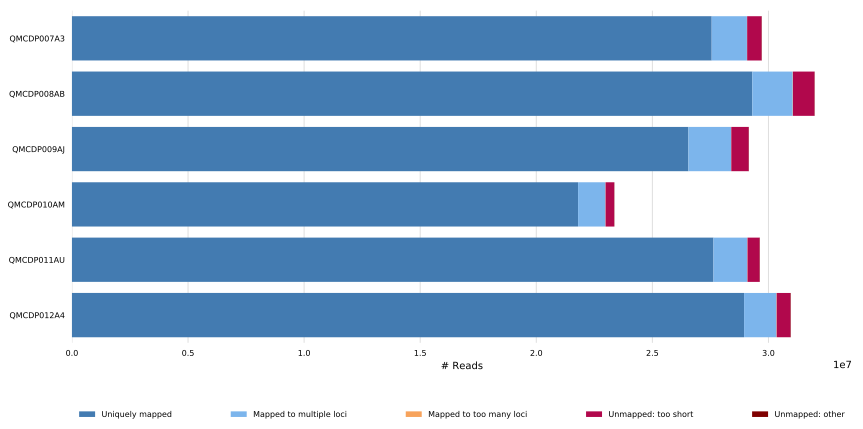
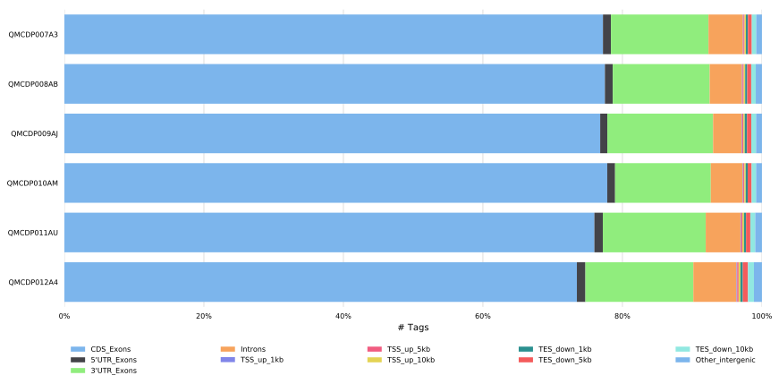
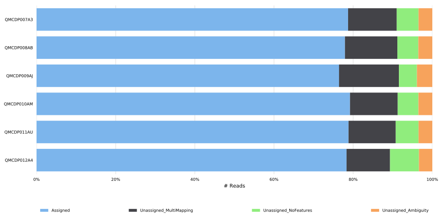
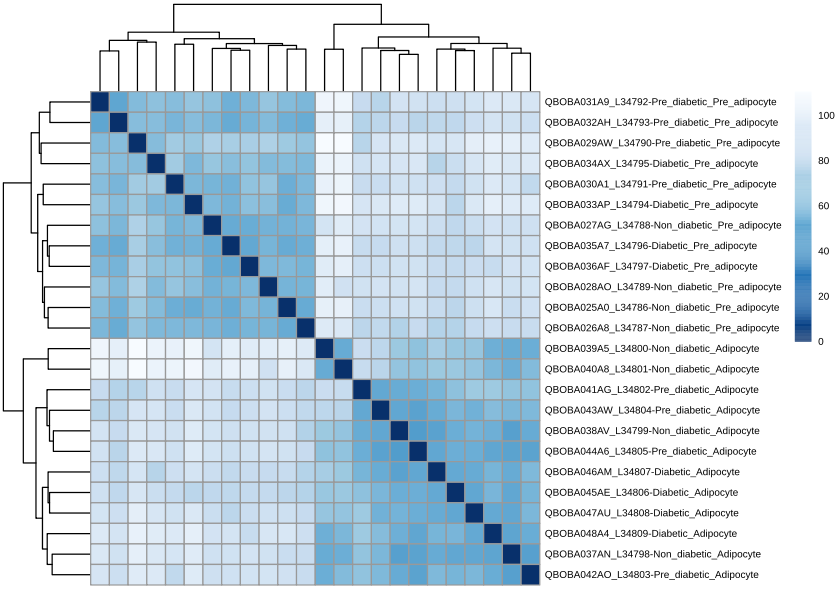
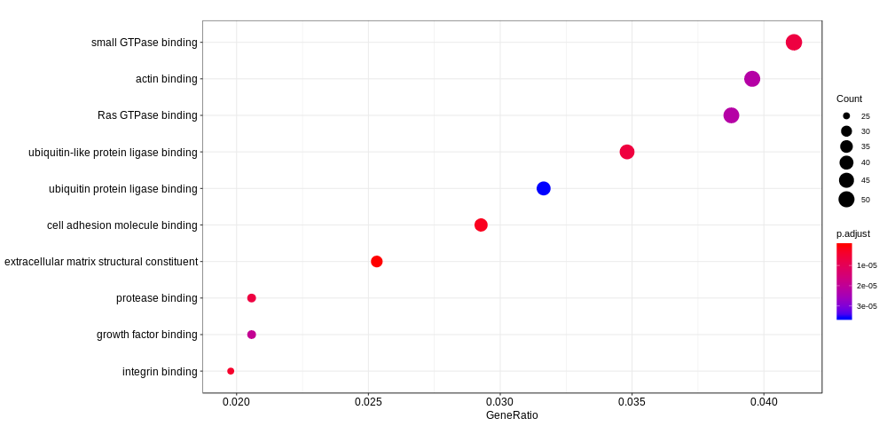

---
output:
  html_document:
    toc: true                               # table of contents
    toc_float: true                         # float the table of contents to the left of the main document content
    toc_depth: 3                            # header levels 1,2,3
    theme: default
    number_sections: true                   # add section numbering to headers
    df_print: paged                         # tables are printed as an html table with support for pagination over rows and columns
    css: corp-styles.css
    highlight: pygments
#   code_folding: none
#   theme: spacelab
    pdf_document: true
#   self_contained: no
bibliography: references.bibtex
---

```{r, bootstrap.show.message=FALSE, echo=FALSE, message=FALSE}
# Import a .tsv file downloadable from https://portal.qbic.uni-tuebingen.de/portal/web/qbic/user-database -> Projects
df <- read.csv(file="./summary.tsv", sep="\t", header = TRUE)
projectcode = as.character(df$Sub.Project)
title = as.character(df$Short.Title)
PI = as.character(df$Principal.Investigator)
PI_address = as.character(df$PI.Adress)
PM = as.character(df$Project.Manager)
```

---
title: "`r projectcode` - Project Report"
subtitle: "`r title`"
author: "`r PM`, Bioinformatics Research Scientist"
date: '`r format(Sys.Date(), "%B %d, %Y")`'
---


<div class="watermark">QBiC</div>


```{r docSetup, bootstrap.show.code = FALSE, dev = 'png', bootstrap.show.message=FALSE, echo=FALSE, message=FALSE}
## knitrBoostrap and device chunk options
options(warn = -1)                          # suppress warnings and messages
library(knitr)
opts_chunk$set(bootstrap.show.code = FALSE, dev = 'png', echo=FALSE)
```

\
\
\
\

**Project Members:** 

***`r PI`***

PI email address

PI department

PI university / Institution


`r PI_address`

\
\
**QBiC contacts:**

***`r PM`***

PM email address

Auf der Morgenstelle 10, 72076 Tuebingen


***

# Introduction and Aims

Introduction and Aims.

***

# RNA Quality Assessment
<!-- If the sequencing has been performed by CeGaT -->
Quality Assessment of the RNA samples by CeGaT can be found [here](./QualityAssessment.pdf). The RNA Integrity Number (RIN) value for all the samples was above ... (with 10 as maximum possible score), which indicates a very good overall RNA quality.

<!-- If the sequencing has been performed by c.ATG -->
Quality Assessment of the RNA samples by <name of the sequencing facility> is shown below. The RNA Integrity Number (RIN) value for all the samples was above ... (with 10 as maximum possible score), which indicates a very good overall RNA quality.

\

```{r}
library(DT)
df_QA <- read.table("./QualityAssessment.csv", header=TRUE, sep="\t")
datatable(df_QA, caption = "Quality Assessment by c.ATG", extensions = c('Buttons', 'FixedColumns'), "Autofill", options = list(dom = 'Bfrtip', scrollX = T, scrollCollapse = T, buttons = c('copy', 'csv', 'excel', 'pdf', 'print')))
```

```{r}
# Import the .csv file output by the rna-seq Nextflow pipeline
df <- read.csv(file="./pipeline_info/software_versions.csv", sep="\t", header = FALSE)
```

***


# Bioinformatics Pipeline
Nextflow-based RNA-Seq pipeline release 1.3 https://github.com/nf-core/rnaseq [^1] was used for the bioinfomatics analysis. Aggregation of the bioinformatics workflow analysis was conducted by `MultiQC `r as.character(df[df$V1=="MultiQC",2])`` [^2] [@ewels2016multiqc]. `FASTQC `r as.character(df[df$V1=="FASTQC",2])`` [^3] [@andrews2010fastqc] was used to determine quality of the FASTQ files. Subsequently, adapter trimming was conducted with `Trim Galore `r as.character(df[df$V1=="Trim Galore!",2])`` [^4] [@krueger2012trim]. `STAR v`r substring(as.character(df[df$V1=="STAR",2]), 7, )`` [@Dobin2013] aligner was used to map the reads that passed the quality control to the human genome GRCh 38 (Ensembl release 92). The evaluation of the RNA-seq experiment was performed with `RSeQC `r as.character(df[df$V1=="RSeQC",2])`` [@wang2012rseqc] and read counting of the features (e.g. genes) with `featureCounts `r as.character(df[df$V1=="featureCounts",2])``[@liao2014featurecounts]. For differential expression analysis, the raw read count table resulting from `featureCounts` is processed with the R package `DESeq2 v`r packageVersion("DESeq2")`` [@love2014differential]. Graphs were also produced in the `RStudio v1.1.456` with `r R.version.string` mainly using the `R` package `ggplot2 v`r packageVersion("ggplot2")``. Reports were produced using the `R` package `rmarkdown v`r packageVersion("rmarkdown")`` while `knitr v`r packageVersion("knitr")`` and `DT v`r packageVersion("DT")`` were running behind the scenes. Sample similarity heatmap was created using `edgeR `r as.character(df[df$V1=="edgeR",2])`` R package.

<!-- If a DEU analysis has also been performed -->
Nextflow-based RNA-Seq pipeline release 1.3 https://github.com/nf-core/rnaseq [^1] was used for the bioinfomatics analysis. Aggregation of the bioinformatics workflow analysis was conducted by `MultiQC `r as.character(df[df$V1=="MultiQC",2])`` [^2] [@ewels2016multiqc]. `FASTQC `r as.character(df[df$V1=="FASTQC",2])`` [^3] [@andrews2010fastqc] was used to determine quality of the FASTQ files. Subsequently, adapter trimming was conducted with `Trim Galore `r as.character(df[df$V1=="Trim Galore!",2])`` [^4] [@krueger2012trim]. `STAR v`r substring(as.character(df[df$V1=="STAR",2]), 7, )`` [@Dobin2013] aligner was used to map the reads that passed the quality control to the human genome GRCh 38 (Ensembl release 92). The evaluation of the RNA-seq experiment was performed with `RSeQC `r as.character(df[df$V1=="RSeQC",2])`` [@wang2012rseqc] and read counting of the features (e.g. genes) with `featureCounts `r as.character(df[df$V1=="featureCounts",2])``[@liao2014featurecounts].
For differential expression analysis, the raw read count table resulting from `featureCounts` is processed with the R package `DESeq2 v`r packageVersion("DESeq2")`` [@love2014differential]; for differential exon usage, the table count produced by `featureCounts` is processed with the R package `DEXSeq v`r packageVersion("DEXSeq")`` [@anders2012detecting].
Graphs were also produced in the `RStudio v1.1.456` with `r R.version.string` mainly using the `R` package `ggplot2 v`r packageVersion("ggplot2")``. Reports were produced using the `R` package `rmarkdown v`r packageVersion("rmarkdown")`` while `knitr v`r packageVersion("knitr")`` and `DT v`r packageVersion("DT")`` were running behind the scenes. Sample similarity heatmap was created using `edgeR `r as.character(df[df$V1=="edgeR",2])`` R package.

***

# Bioinformatics Analysis

## Bioinformatics Analysis Quality Control Summary
Quality control of the data was performed using *FASTQC*. Details on the quality control parameters are available in the `MultiQC` report of all samples available [here](./results/MultiQC/multiqc_report.html). `FASTQC` reports for individual samples are additionally available [here](./results/fastqc_reports.zip).
The table below (extracted from the `MultiQC` report) shows a summary of the bioinformatics analysis quality control including the percentage and number of assigned reads (% Assigned, M Assigned), the percentage of aligned reads (% Aligned), trimmed reads (% Trimmed), and duplicate reads (% Dups). The mean GC content (%GC) for each of the sequences and total number of reads (M Seqs) is additionally indicated.

```{r include=FALSE}
# loading this library produces an output, exlude with include=FALSE
library(tidyverse)
```

```{r}
library(DT)
df_DE <- read.table("./results/MultiQC/multiqc_data/multiqc_general_stats.txt", header=TRUE, sep="\t")
columns <- c("Sample", "featureCounts_mqc.generalstats.featurecounts.percent_assigned", "featureCounts_mqc.generalstats.featurecounts.Assigned",
             "STAR_mqc.generalstats.star.uniquely_mapped_percent", "Cutadapt_mqc.generalstats.cutadapt.percent_trimmed", 
             "FastQC_mqc.generalstats.fastqc.percent_duplicates", "FastQC_mqc.generalstats.fastqc.percent_gc",
             "FastQC_mqc.generalstats.fastqc.total_sequences")
df_DE_selected = df_DE %>% select(one_of(columns))
n_rows = nrow(df_DE_selected)
datatable(df_DE_selected, caption = "Final list DeSEQ2", colnames= c("Sample Name", "% Assigned", "Assigned", "% Aligned", "% Trimmed", "% Dups", "% GC", "Seqs"), extensions = c('Buttons', 'FixedColumns'), "Autofill", options = list(dom = 'Bfrtip', scrollX = T, scrollCollapse = T, buttons = c('copy', 'csv', 'excel', 'pdf', 'print'), pageLength = 10)) #args not working: lengthMenu = c(5, 10, 20, n_rows)))
```

## Mapping Statistics

The alignment scores for each sample (in percentages and number of reads) are shown below.

### Generalities about mapping rate

The mapping rate of data originating from the sequencing machine depends on several factors:

* The error rate of an Illumina sequencing machine is ~0.1%.
* The error rate for sequencing of GC rich regions is higher.
* Sequencing devices are not able to sequence highly repeated regions.
* Low quality of sequencing data results in a low mapping rate.
* There is no perfect algorithm to align the reads to a reference genome.
* There is no perfect transcript annotation of the reference genome.

<center>
```{r, echo=F, out.width="160%", dpi=1800, fig.cap="STAR: Alignment Scores - Percentages", fig.align='center'}

```
\
```{r, echo=F, out.width="160%", dpi=1200, fig.cap="STAR: Alignment Scores - Number of Reads", fig.align='center'}

```
</center>

The range of mapping rate for uniquely mapped reads is > ...%, which corresponds to a very good score.

## Read Distribution
The read distribution of mapped reads over different genome feature (like CDS exon, 5'UTR exon, 3' UTR exon, Intron, Intergenic regions) is shown below (in percentages). The majority of the reads is assigned to CDS exons.

<center>
```{r, echo=F, out.width="160%", dpi=1200, fig.cap="RSeQC: Read Distribution", fig.align='center'}

```
</center>

## Gene Counts
The gene assignments of featureCounts are shown below. Interpretation of the different assignment types:

**Unassigned_Ambiguity:** The reads could not be assigned because of its ambiguous character. This can be the case when e.g. a read maps to two different genes at the same time making it ambiguos. \
**Unassigned_MultiMapping:** The reads could not be assigned because they map to several distinct locations on the reference genome. \
**Unassigned_NoFeatures:** The reads could not be assigned because their mapping position in the reference genome is not annotated with any gene.

<center>
```{r, echo=F, out.width="160%", dpi=1200, fig.cap="featureCounts: Assignments", fig.align='center'}

```
</center>

The assignment rate is > ...%, which corresponds to a very good score.

***

# Statistical Analysis

## Raw and normalized count tables

The raw count table can be found [here](./DESeq2/raw_counts/merged_gene_counts.txt). The normalized count table is available [here](./DESeq2/results/tables/): rlog_transformed.read.counts.tsv.

## Overview - First Exploration of the Data

### Principal Component Analysis (PCA) 
A PCA plot of the normalized expression values was created to visualize the overall effect of experimental variations and any batch effects among samples.

```{r, echo=F, out.width="2000px", dpi=1200, fig.cap="", fig.align='center'}
knitr::include_graphics("./DESeq2/results/plots/PCA_plot_of_distances.svg")
```

The two first principal components PC1 and PC2 explain ...% of the sample variance. Representation of the samples in the two principal components axis shows a clustering of the samples according to the experimental groups ... and ... .

### Sample distance heatmap
A sample distance heatmap was generated from the distances of the normalized expression values for all samples. The closer the distance is to 0, the overall samples gene expression are more similar to each other.

```{r, echo=F, out.width="2000px", dpi=1200, fig.cap="", fig.align='center'}

```

## Differentially Expressed Genes (DEGs)

### List of differentially expressed genes

Analysis of the differential gene expression was performed using `DESeq2`. Genes were considered differentially expressed genes (DEG) when the adjusted p-value was lower than 0.05 (padj < 0.05). The adjusted p-value is calculated in the `DESeq2` package with the Benjamini-Hochberg method and helps reduce the number of false postives (not real differentially expressed genes). The model design in DESeq2 was: (example: exp ~x, where x is the treatment factor with the levels Vpr and GFP).
The list of all the differentially expressed genes is shown below; The full table, where the differentially expressed genes are marked with DE in the filter1 column, can be found [here](./DESeq2/results/final/):

```{r}
library(DT)
df_DE <- read.table("./DESeq2/results/final/DE_list_DESeq2.tsv", header=TRUE, sep="\t")
datatable(df_DE, caption = "Table containing DE genes", extensions = c('Buttons', 'FixedColumns'), "Autofill", options = list(dom = 'Bfrtip', scrollX = T, scrollCollapse = T, buttons = c('copy', 'csv', 'excel', 'pdf', 'print')))
```

<!-- If special contrasts have been requested -->
Additional tables for all individual contrasts are provided in [DE_tables](./DESeq2/results/tables/):

(example:)
* final_list_DESeq2.tsv: tab-separated file containing a list of all genes and their log2 fold change for the different contrasts compared.
* DE_genes_Diabetic_Pre_adipocyte_vs_Diabetic_Adipocyte: this table contains only genes that were differentially expressed in contrast diabetic pre-adipocyte vs diabetic adipocyte.
[...]

**Please note that the number of differentially expressed genes can be shrinked if one wishes to focus only on the genes with a very meaningful fold change.**

### Plot normalized counts of the genes

Plots of the normalized counts were generated for the all the genes. Count normalization was performed by sequencing depth and adding a pseudocount of 1/2 to allow for log scale plotting. The plots are available at [plot_candidate_genes](./DESeq2/results/plots/plots_candidate_genes).

<!-- In case GO and/or KEGG enrichment analysis were also included -->
## Gene Ontology
Gene Ontology enrichment analysis was performed using `clusterProfiler v`r packageVersion("clusterProfiler")``; GO terms that were enriched can be found in the respective table [here](./GO):

The corresponding plot is shown below and can be found in the same folder:
<center>
```{r, echo=F, out.width="2000px", dpi=1200, fig.cap="Enriched GO terms", fig.align='center'}

```
</center>

## KEGG pathway analysis
Enriched KEGG pathways of interest were found using a pathway analysis with `clusterProfiler`.
A list of the pathways enriched, can be found [here](./KEGG/): kegg_enriched_pathways.tsv. The plots of the KEGG pathways that were enriched can be found in the respective folders [here](./KEGG/pathway_plots). In the maps, red corresponds to upregulated and green to downregulated parts of the pathways. There hardly is a difference in colour intensity between ~ 0.5 and 2.5 fold change.

<!-- In case a DEU analysis was also included -->
## Differential Exon Usage
Analysis of the differential exon usage was performed using DEXSeq. Exons were considered differentially used (DEU) when the adjusted p-value was lower than 0.1 (padj < 0.1); the adjusted p-value helps reduce the number of false postives (not real differentially used exons). For each gene, the model design in DEXSeq was a generalized linear model with the formula: ∼ sample + exon + condition:exon, compared to the smaller model (the null model): ∼ sample + exon. In this design condition is ... (example: the experimental variable infected (Vpr) or control (GFP) cell). The list of all the differentially used exons can be found [here](./DEXSeq/DEXSeq_results_significant.txt).

### Fitted Expression Values Visualization
Plots of the fitted expression values of each exon were generated for a subset of 20 genes among those showing differential exon usage. The plots are available in [this folder](./DEXSeq/plots); in each graph both the experimental conditions are indicated, and the exon that showed significant differential usage is shown in purple.

***
# Outlook

Outlook, in case there is something to mention.

***
# Bibliography
[^1]: https://www.nextflow.io/
[^2]: http://multiqc.info/
[^3]: https://www.bioinformatics.babraham.ac.uk/projects/fastqc/
[^4]: https://www.bioinformatics.babraham.ac.uk/projects/trim_galore/
[^6]: http://smithlabresearch.org/software/preseq/
[^7]: https://ccb.jhu.edu/software/stringtie/
[^8]: http://broadinstitute.github.io/picard/